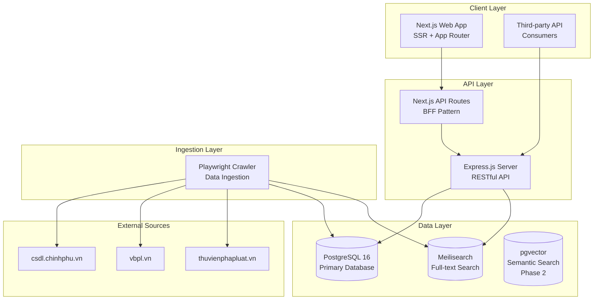
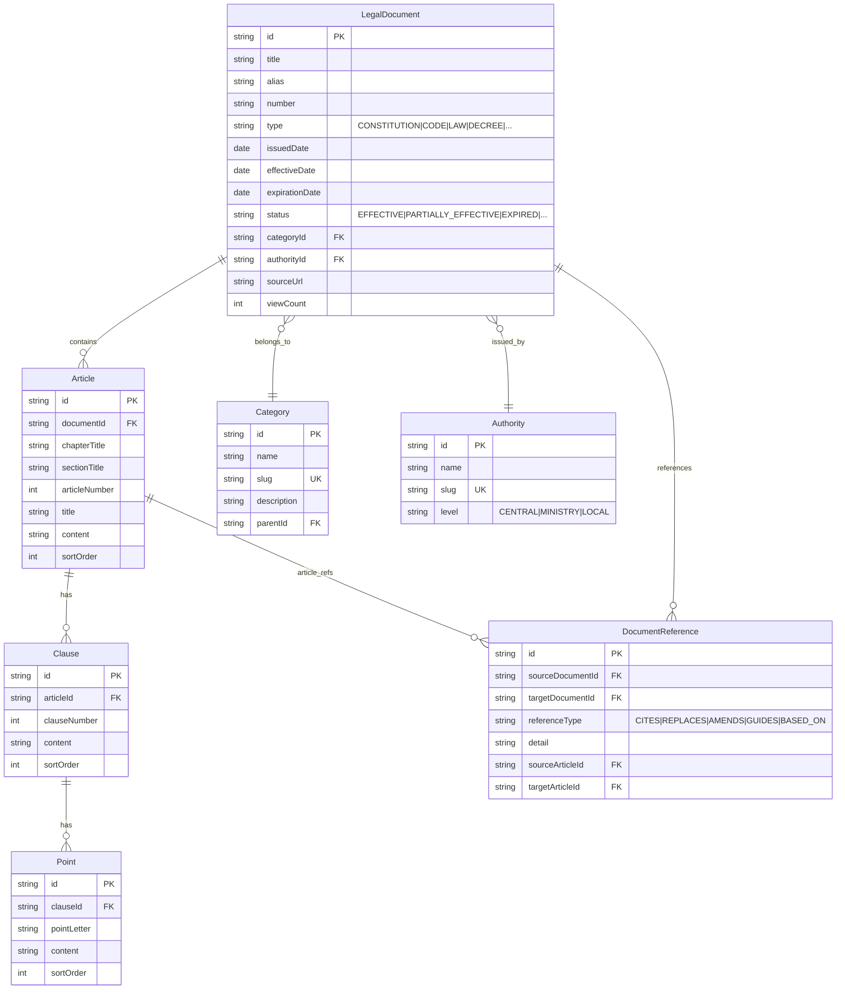
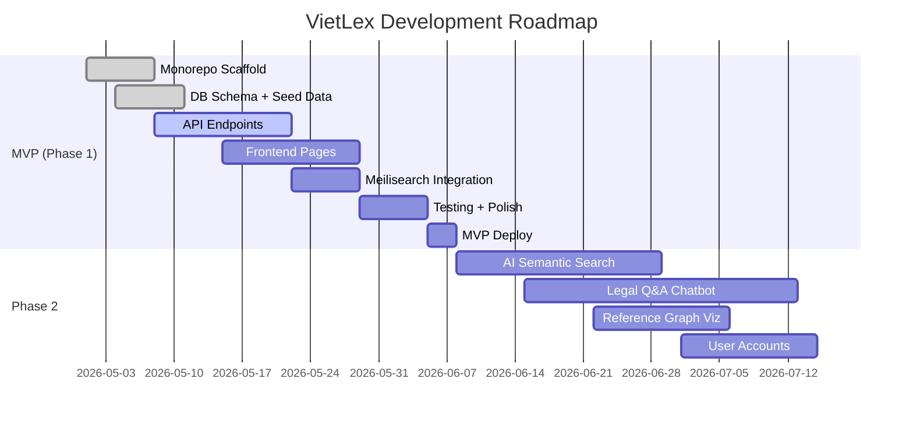

<p align="center">
  
</p>

<p align="center">
  
  
  
  
  
  
</p>

<h1 align="center">VietLex</h1>
<p align="center"><strong>Vietnam Legal Intelligence Platform</strong></p>

---

## Overview

**VietLex** is an open-source platform for searching, browsing, and researching Vietnam's legal documents. It tackles the fragmentation problem in Vietnamese legal data — where statutes are scattered across multiple government portals with inconsistent quality and no cross-referencing.

### The Problem

Finding a specific Vietnamese legal document today means:
- Jumping between multiple disconnected websites (vbpl.vn, thuvienphapluat.vn, csdl.chinhphu.vn...)
- No way to visualize how documents reference, amend, or supersede each other
- Hard to determine which articles remain in effect and which have been modified
- Poor mobile experience across most existing platforms

### The Solution

VietLex consolidates legal data into a single intelligent platform:

- **Full-text search** — fast, typo-tolerant, Vietnamese-language optimized
- **Smart navigation** — browse by chapter → section → article → clause → point
- **Reference graph** — visualize document-to-document relationships
- **Effectiveness tracking** — per-article status across amendments

---

## Features

### MVP (Phase 1)

| Feature | Description | Status |
|---------|-------------|:------:|
| Document Database | Structured: document → chapter → article → clause → point | ✅ |
| Full-text Search | Meilisearch-powered, Vietnamese language support | ✅ |
| Filter & Browse | By category, document type, issuing authority, year | ✅ |
| Document Viewer | Table of contents tree, breadcrumb, keyword highlight | ✅ |
| Responsive Design | Desktop, tablet, mobile optimized | ✅ |
| Public API | RESTful API with full documentation | ✅ |

### Phase 2 (Planned)

| Feature | Description |
|---------|-------------|
| 🤖 AI Semantic Search | Vector embeddings + RAG — search by meaning, not just keywords |
| 💬 Legal Q&A Chatbot | AI-powered answers grounded in the document database |
| 🕸️ Reference Graph | Interactive DAG visualization of inter-document relationships |
| 📜 Amendment History | Per-article diff tracking across versions |
| 👤 User Accounts | Bookmarks, notes, personal search history |

---

## System Architecture



---

## Data Models



---

## Tech Stack

| Layer | Technology | Purpose |
|-------|-----------|---------|
| **Frontend** | Next.js 14, React 18, TypeScript | SSR + App Router, SEO-optimized |
| **Styling** | Tailwind CSS | Utility-first, responsive |
| **API** | Express.js 4 | Lightweight REST layer |
| **ORM** | Prisma | Type-safe DB access, migrations |
| **Database** | PostgreSQL 16 | Relational data, built-in FTS |
| **Search** | Meilisearch | Vietnamese full-text, typo-tolerant |
| **Vector** | pgvector | Semantic search (Phase 2) |
| **Crawler** | Playwright + Cheerio | Public source ingestion |
| **Monorepo** | pnpm workspaces + Turborepo | Multi-package orchestration |
| **Infra** | Docker Compose | Reproducible dev environment |
| **Validation** | Zod | Runtime type safety |

---

## Project Structure

```
vietlex/
├── packages/
│   ├── shared/                    # Shared TypeScript types & constants
│   │   └── src/
│   │       └── index.ts           # All type definitions
│   │
│   ├── api/                       # Backend REST API
│   │   ├── prisma/
│   │   │   ├── schema.prisma      # Database schema (6 models)
│   │   │   └── seed.ts            # Seed data
│   │   └── src/
│   │       ├── index.ts           # Express server entry
│   │       ├── lib/
│   │       │   ├── prisma.ts      # Prisma client singleton
│   │       │   └── meilisearch.ts # Meilisearch client
│   │       ├── middleware/
│   │       │   ├── errorHandler.ts
│   │       │   └── validate.ts
│   │       ├── routes/
│   │       │   ├── documents.ts   # CRUD + filter + pagination
│   │       │   ├── categories.ts  # Category tree
│   │       │   ├── authorities.ts # Issuing authorities
│   │       │   ├── search.ts      # Full-text search
│   │       │   └── references.ts  # Document reference graph
│   │       └── services/
│   │           ├── document.service.ts
│   │           ├── search.service.ts
│   │           └── reference.service.ts
│   │
│   ├── web/                       # Next.js frontend
│   │   └── src/
│   │       ├── app/
│   │       │   ├── page.tsx       # Homepage
│   │       │   ├── layout.tsx     # Root layout
│   │       │   ├── globals.css    # Tailwind + custom styles
│   │       │   ├── search/        # Search page
│   │       │   ├── van-ban/[id]/  # Document detail page
│   │       │   └── linh-vuc/      # Category page
│   │       ├── components/
│   │       │   ├── Header.tsx
│   │       │   ├── Footer.tsx
│   │       │   ├── SearchBar.tsx
│   │       │   ├── DocumentCard.tsx
│   │       │   ├── CategoryCard.tsx
│   │       │   └── ArticleTree.tsx
│   │       └── lib/
│   │           └── api.ts         # API client
│   │
│   └── crawler/                   # Data ingestion
│       └── src/
│           └── index.ts           # Base crawler + CSDL source stub
│
├── docs/
│   └── proposal.md                # Project proposal & budget
├── output/                        # Generated assets
├── docker-compose.yml             # PostgreSQL + Meilisearch
├── turbo.json                     # Turborepo config
├── pnpm-workspace.yaml            # pnpm workspace definition
└── tsconfig.base.json             # Shared TypeScript config
```

---

## Quick Start

### Prerequisites

| Tool | Version |
|------|---------|
| Node.js | >= 20 |
| pnpm | >= 9.0 |
| Docker | Latest stable |

### Setup

```bash
# 1. Clone & enter
git clone https://github.com/your-org/vietlex.git
cd vietlex

# 2. Install dependencies
pnpm install

# 3. Start infrastructure
docker compose up -d

# 4. Configure environment
cp packages/api/.env.example packages/api/.env

# 5. Run database migrations
cd packages/api
pnpm db:migrate

# 6. Seed sample data
pnpm db:seed

# 7. Start development
cd ../..
pnpm dev
```

### Service URLs

| Service | URL |
|---------|-----|
| **Web App** | http://localhost:3000 |
| **REST API** | http://localhost:3001/api |
| **Health Check** | http://localhost:3001/api/health |
| **Meilisearch** | http://localhost:7700 |
| **Prisma Studio** | `cd packages/api && pnpm db:studio` |

---

## API Reference

### Documents

| Method | Endpoint | Description |
|--------|----------|-------------|
| `GET` | `/api/documents` | List documents (filtered, paginated) |
| `GET` | `/api/documents/:id` | Document detail (with articles) |
| `GET` | `/api/documents/:id/articles` | Article list for a document |

### Search

| Method | Endpoint | Description |
|--------|----------|-------------|
| `GET` | `/api/search?q=...&type=documents` | Search documents |
| `GET` | `/api/search?q=...&type=articles` | Search within articles |

### Categories & Authorities

| Method | Endpoint | Description |
|--------|----------|-------------|
| `GET` | `/api/categories` | Category tree |
| `GET` | `/api/categories/:slug` | Category detail + doc count |
| `GET` | `/api/authorities` | Issuing authorities list |
| `GET` | `/api/authorities/:slug` | Authority detail + doc count |

### References

| Method | Endpoint | Description |
|--------|----------|-------------|
| `GET` | `/api/references/:documentId` | Reference graph (inbound + outbound) |

### Query Parameters — `GET /api/documents`

| Param | Type | Description |
|-------|------|-------------|
| `page` | int | Page number (default: 1) |
| `pageSize` | int | Items per page (default: 20, max: 100) |
| `categoryId` | string | Filter by legal category |
| `authorityId` | string | Filter by issuing body |
| `type` | string | Document type (`LAW`, `DECREE`, `CIRCULAR`...) |
| `status` | string | Effectiveness (`EFFECTIVE`, `EXPIRED`...) |
| `year` | int | Issuance year |
| `sortBy` | string | Field: `issuedDate`, `effectiveDate`, `viewCount` |
| `sortOrder` | string | `asc` or `desc` (default: `desc`) |

---

## Roadmap



---

## Contributing

We welcome contributions. See [CONTRIBUTING.md](CONTRIBUTING.md) for the full process.

### Areas we need help

- **Crawlers** — connect new data sources (vbpl.vn, thuvienphapluat.vn...)
- **Data** — normalize and clean existing document corpus
- **UI/UX** — improve interface and user experience
- **AI/ML** — RAG pipelines, semantic search, legal QA
- **Docs** — API guides, usage tutorials, translations

---

## License

MIT © 2026 VietLex Contributors

---

<p align="center">
  <sub>Legal data aggregated from publicly available Vietnamese government sources.</sub>
</p>
